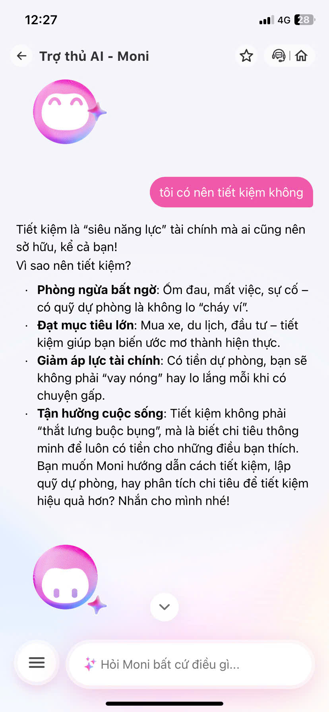

# Workshop — Mổ App AI Thật: Moni (MoMo)

**Người thực hiện:** Hoàng Phúc Quân — 2A202600560  
**Ngày:** 03/06/2026

---

## 1. Sản phẩm & Promise vs Reality

### Product hứa gì?

Moni là trợ thủ tài chính AI được tích hợp trong ứng dụng MoMo. Nhìn vào cách MoMo quảng bá tính năng này, có thể thấy ba lời hứa lớn:

1. **Hiểu chi tiêu cá nhân** — AI tự động phân loại và theo dõi thu chi, giúp người dùng nắm rõ tiền của mình đi đâu mà không cần nhập tay.
2. **Đưa insight có giá trị** — Không chỉ hiển thị số, Moni hứa sẽ phân tích sâu và đưa ra lời khuyên tài chính cá nhân hóa, cảnh báo khi chi tiêu vượt ngưỡng.
3. **Trò chuyện tự nhiên** — Người dùng chỉ cần hỏi bằng ngôn ngữ tự nhiên, Moni sẽ hiểu và phản hồi như một cố vấn tài chính thực sự.

### User target là ai?

Người dùng MoMo đang muốn quản lý chi tiêu cá nhân tốt hơn — không phải chuyên gia tài chính, mà là người bình thường muốn hiểu mình đang tiêu tiền vào đâu và có nên điều chỉnh gì không.

### Kỳ vọng khi dùng thử

Tôi kỳ vọng AI có thể: nhận diện intent tài chính phức tạp, hỏi lại khi thông tin chưa đủ, và đưa ra lời khuyên cụ thể có căn cứ dựa trên dữ liệu chi tiêu thực của tôi.

### Thực tế khi dùng thật

Tôi đã thử hai prompt cụ thể và quan sát hành vi của Moni:

**Prompt 1:** *"tôi có nên tiết kiệm không"*

Moni trả lời bằng một đoạn văn có vẻ thuyết phục nhưng hoàn toàn generic — liệt kê lý do tại sao tiết kiệm tốt (phòng ngừa bất ngờ, đạt mục tiêu lớn, giảm áp lực tài chính...). Không một câu nào dựa trên dữ liệu chi tiêu thực của người dùng. AI không hỏi thêm, không biết tôi đang tiêu bao nhiêu, và vẫn tự tin tư vấn.

**Prompt 2:** *"tháng trước tôi tiêu tiền như vậy có ổn không"*

Đây là lúc điểm gãy rõ nhất. Moni trả lời: *"Bạn chưa thiết lập ngân sách chi tiêu cho tháng trước, nên Moni không thể đánh giá bạn tiêu tiền có ổn hay không."* — Sau đó hỏi có muốn lập ngân sách không. App có đủ dữ liệu lịch sử giao dịch của tôi, nhưng Moni không chủ động dùng dữ liệu đó để phân tích. Thay vào đó, AI chuyển trách nhiệm về phía user bằng cách yêu cầu thiết lập ngân sách thủ công trước.

**Screenshots quan sát được:**

- Screenshot 1 : Moni trả lời câu hỏi tiết kiệm bằng nội dung giáo khoa, không có dữ liệu cá nhân.
- Screenshot 2 : Moni từ chối đánh giá chi tiêu do thiếu ngân sách được thiết lập sẵn, dù app có lịch sử giao dịch.

---

## 2. Phân tích 4 Paths

### Happy Path — Khi AI đúng và tự tin

Khi user hỏi những câu đơn giản có data đầy đủ (ví dụ: "Tháng này tôi tiêu bao nhiêu tiền ăn?"), Moni hoạt động tốt: phân loại tự động, hiển thị số liệu theo category và đôi khi đưa gợi ý. Đây là điểm mạnh nhất của sản phẩm — phần automation phân loại chi tiêu.

### Low-Confidence Path — Khi AI không chắc

**Điểm gãy lớn nhất.** Quan sát từ cả hai screenshot cho thấy Moni **hầu như không hỏi lại** khi intent không rõ. Thay vì detect "tôi có nên tiết kiệm không" là câu hỏi mơ hồ và hỏi thêm ngữ cảnh (tiết kiệm cho mục tiêu gì? đang tiêu bao nhiêu?), AI lập tức trả lời chung chung. Không có cơ chế "hỏi clarifying question" trước khi trả lời — đây là lỗ hổng thiết kế lớn nhất.

### Failure Path — Khi AI sai hoặc không đủ năng lực

Ở prompt 2, Moni không sai về mặt dữ liệu, nhưng **sai về cách xử lý failure**. Thay vì dùng lịch sử giao dịch sẵn có để ước tính "ổn hay không so với tháng bình thường", AI chọn cách an toàn nhất: báo lỗi thiếu dữ liệu và chuyển hướng. User nhận được thông báo dạng "system error" thay vì một fallback hữu ích.

### Correction Path — Khi user sửa sai

Chưa thấy cơ chế correction rõ ràng. Nếu AI phân loại sai một khoản chi tiêu, user có thể sửa thủ công trong phần giao dịch, nhưng không có bằng chứng AI học lại từ feedback đó cho lần sau. Cuộc trò chuyện có context ngắn hạn trong phiên, nhưng không có memory dài hạn — sửa hôm nay, hỏi lại tuần sau AI vẫn không nhớ.

---

## 3. Key Findings — Viết thành Quyết định Product

### Finding 1: Intent mơ hồ bị xử lý như keyword

> Khi user hỏi *"tôi có nên tiết kiệm không"* — một câu hỏi tài chính mang ngữ cảnh cá nhân,  
> Moni xử lý như keyword search ("tiết kiệm") và trả lời bằng nội dung giáo khoa có sẵn,  
> hậu quả là user không nhận được insight cá nhân hóa nào, cảm thấy đang nói chuyện với chatbot FAQ thay vì trợ lý tài chính thực sự.  
> **Lỗi thuộc layer:** Intent Understanding + Promise (AI hứa cá nhân hóa nhưng không thực hiện).  
> **Nên sửa bằng:** Thiết kế low-confidence flow — khi AI detect câu hỏi tài chính mơ hồ, hỏi clarifying trước: *"Bạn đang muốn tiết kiệm cho mục tiêu cụ thể nào? Hay muốn mình xem lại chi tiêu gần đây?"* — sau đó dùng data thực để trả lời.

### Finding 2: Data có sẵn nhưng không được tận dụng khi cần nhất

> Khi user hỏi *"tháng trước tôi tiêu tiền như vậy có ổn không"* — câu hỏi có thể trả lời bằng lịch sử giao dịch,  
> Moni từ chối đánh giá vì "chưa thiết lập ngân sách", dù app có đầy đủ dữ liệu giao dịch thực,  
> hậu quả là user bị chặn ở bước thiết lập ngân sách thủ công — một friction không cần thiết làm giảm trust vào AI.  
> **Lỗi thuộc layer:** Data-Tool + UX Recovery (AI không fallback sang dữ liệu có sẵn).  
> **Nên sửa bằng:** Khi không có ngân sách được thiết lập, AI nên fallback sang phân tích pattern: *"Bạn chưa có ngân sách, nhưng tháng trước bạn tiêu X triệu, cao hơn 15% so với tháng trước nữa — bạn muốn mình xem chi tiết không?"*

### Finding 3: Không có fallback rõ ràng — user dễ bỏ cuộc

> Khi AI không đủ thông tin để trả lời,  
> hệ thống không có cơ chế fallback rõ ràng (không hỏi lại, không chuyển sang tùy chọn khác, không đề xuất human support),  
> hậu quả là user nhận thông báo dạng "không thể làm được" và tự mày mò hoặc bỏ cuộc.  
> **Lỗi thuộc layer:** Safety + UX Recovery.  
> **Nên sửa bằng:** Xây dựng failure state rõ ràng với ít nhất 2 options: (a) hướng dẫn user cung cấp thêm thông tin, hoặc (b) chuyển sang tư vấn viên người thật nếu câu hỏi quá phức tạp.

---

## 4. Sketch As-is / To-be

### As-is (Flow hiện tại)

```
User nhập câu hỏi tài chính
        ↓
AI xử lý như keyword search
        ↓
    [intent rõ ràng?]
    /             \
  Có              Không
  ↓                 ↓
Trả lời OK    Trả lời generic
              hoặc báo "thiếu data"
                    ↓
              ❌ User không biết làm gì tiếp
              → Tự mày mò hoặc bỏ cuộc
```

*Điểm gãy: Không có low-confidence detection. Không có fallback hữu ích. Data có sẵn không được dùng.*

---

### To-be (Flow đề xuất)

```
User nhập câu hỏi tài chính
        ↓
AI detect intent + confidence level
        ↓
  [High confidence?]
    /          \
  Có           Không
  ↓              ↓
Trả lời     AI hỏi clarifying:
cá nhân     "Bạn muốn xem gì cụ thể?"
hóa         + show 2-3 options
  ↓              ↓
Output      User chọn/sửa → AI dùng data thực
OK          → Output cá nhân hóa
  ↓              ↓
[AI sai?]   [Vẫn không đủ data?]
  ↓              ↓
User sửa    Fallback → Gợi ý tư vấn viên người thật
  ↓
AI lưu correction → cải thiện lần sau
```

*Thay đổi chính: Thêm low-confidence detection → clarifying question → dùng data giao dịch thực → có correction loop và human fallback.*

---

## 5. Tác động đến Build Slice (cho Day 06)

Các finding từ bài mổ app này trực tiếp ảnh hưởng đến thin SPEC của prototype:

- **Ưu tiên #1 — Clarification loop:** Bất kỳ câu hỏi tài chính mơ hồ nào cũng phải được AI hỏi lại trước khi trả lời. Đây là điều Moni thiếu hoàn toàn.
- **Ưu tiên #2 — Dùng data có sẵn:** Build slice phải tập trung vào việc kết nối intent của user với dữ liệu giao dịch thực, không để AI từ chối vì thiếu cấu hình.
- **Ưu tiên #3 — Failure state rõ ràng:** Mọi failure đều phải có ít nhất một đường thoát cho user — không được để màn hình "bế tắc".

**Thay đổi trong SPEC:** Finding này yêu cầu thêm một bước **"intent clarification"** vào flow trước khi AI sinh response. Nếu confidence < threshold, AI phải hỏi lại thay vì trả lời đoán.

---
